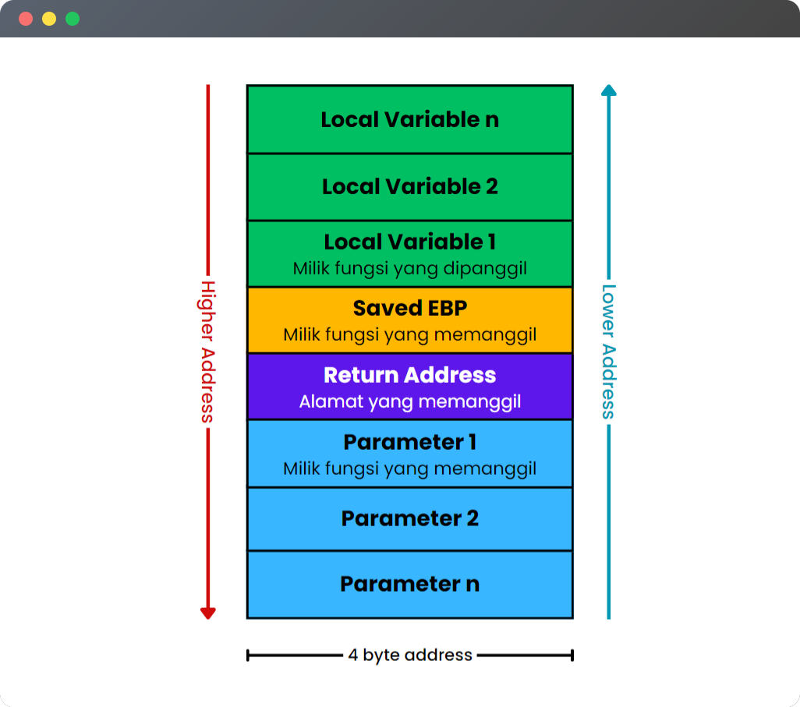
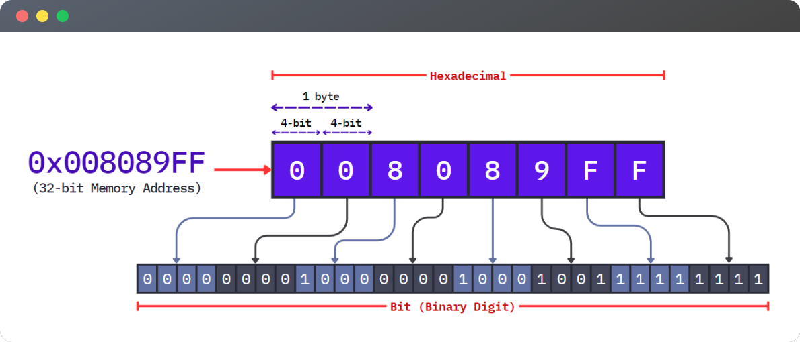

<p align="left"> <a href="https://www.cprogramming.com/" target="_blank" rel="noreferrer">  </a> <a href="https://www.linux.org/" target="_blank" rel="noreferrer">  </a> </p>

# Description

**My Notion notes when learning about the basics of Assembly, Computer Architecture, and a bit of Operating Systems** started from early-2023. This repo is basically my learning progress about assembly which will be updated continuously whenever I get confused.

I have an interest in low-level analysis, such as reversing a program, Return Oriented Programming, and exploiting ELF binary, which is why im learning this language. I often forget how things work in Assembly and Computer Architecture because it’s so hard to understand at the beginning. So when it happens, i usually take a note. And here's what I've learned so far.

# Table of Contents

- [**Memory Layout**](#memory-layout)
- [**Stack Layout**](#stack-layout)
    - [Arsitektur x86](#arsitektur-x86)
    - [Arsitektur x86-64](#arsitektur-x86-64)
- [**Register**](#register)
    - [General Purpose Register](#general-purpose-register)
    - [Index Register](#index-register)
    - [Pointer Register](#pointer-register)
- [**Memory Address**](#memory-address)
    - [Byte Ordering (Endianness)](#byte-ordering-endianness)
        - [Most Significant Bit (MSB)](#most-significant-bit-msb)
        - [Least Significant Bit (LSB)](#least-significant-bit-lsb)
        - [Big Endian](#big-endian)
        - [Little Endian](#little-endian)
    - [Base Address & Offset](#base-address--offset)
- [**System Call**](#system-call)
    - [`sys_open`](#sys_open)
    - [`sys_read`](#sys_read)
    - [`sys_write`](#sys_write)
    - [`sys_exit`](#sys_exit)
- [**Addressing Modes**](#addressing-modes)
- [**Practice (Reversing a simple program) - (TODO)**](#practice-reversing-a-simple-program---todo)

# Memory Layout

Pembagian memori menjadi beberapa layout bertujuan sebagai proteksi memori agar segmen-segmen berbeda dapat diberi hak akses yang berbeda. Misal, segmen teks dapat diberi hak baca saja (read-only) untuk melindungi kode program dari modifikasi. Berikut adalah visualisasi layout memory untuk arsitektur 32 bit.


1. Text Segment (Kode): Menyimpan instruksi-instruksi mesin dari program yang sedang berjalan. Instruksi ini membentuk kode eksekusi program.
2. Data Segment: Berisi variabel yang diinisialisasi dengan nilai tertentu.
3. Heap: Alokasi memori dinamis, seperti ketika program menggunakan fungsi `malloc()` atau `new` untuk mengalokasikan memori secara dinamis.
4. Stack: Menyimpan data dan informasi terkait fungsi-fungsi dalam program seperti variabel lokal, parameter fungsi, dan return address.
5. Kernel Space: Area yg ditempati oleh kernel OS. Hanya kode kernel yang dapat mengakses ruang memori ini.


# Stack Layout

Stack bersifat LIFO (Last In, First Out), yang berarti data yang dimasukkan terakhir akan keluar pertama kali. **Stack tumbuh dari address yang tinggi ke address yang lebih rendah**. Namun, susunan variable local pada stack di memory tergantung compilernya

Stack biasanya digunakan untuk menyimpan data yang bersifat sementara, dan ketika fungsi selesai dieksekusi, frame stacknya dihapus dari stack. Hal ini berbeda dengan heap, yang digunakan untuk alokasi memori dinamis yang dapat bertahan lebih lama.

Setiap arsitektur prosesor memiliki layout yang berbeda. 

## Arsitektur x86

Di dalam layout memory terdapat Stack yang berfungsi untuk mengelola function call dan return address. Stack ini sendiri terdiri atas beberapa bagian, yaitu sebagai berikut.



- **Saved EBP:** Nilai EBP yang disimpan pada awal frame. Lokasi awal (base) dari frame fungsi saat ini
- **Return Address:** Saat fungsi dipanggil, return address disimpan di dalam stack agar program dapat kembali ke instruksi berikutnya setelah function call selesai

Data dimasukkan ke dalam stack menggunakan operasi "push", sedangkan dihapus menggunakan operasi "pop". Parameter fungsi akan dipush ke dalam stack mulai dari parameter terakhir sampai parameter pertama. 

## Arsitektur x86-64

Terdapat beberapa perbedaan antara arsitektur x86 dengan x86-64.

- **Register:** Pada arsitektur x86-64, nama register diawali dengan prefix “R” (Register). Contohnya seperti RAX, RBX, RCX, dan RDX.
- **Parameter:** Setiap parameter fungsi akan ditambahkan ke dalam register RDI, RSI, RDX, RCX, R8, dan R9 secara berurutan. Jika parameter lebih dari 6, maka akan disimpan di dalam stack.


# Register

Register dan stack merupakan 2 konsep yang berbeda.  **Register terletak di dalam prosesor, sedangkan stack terletak di dalam memori**. Oleh karena itu register mampu menyimpan data untuk processing dengan cepat karena terletak di dalam CPU. Data pada register diakses secara langsung oleh prosesor tanpa perlu alamat memori.

Nama register berbeda-beda tergantung arsitekturnya. Misalnya **`RBX`** merupakan register 64 bit, sedangkan **`EBX`** adalah versi 32-bit dari register `RBX`, begitupun dengan register lainnya. Pada arsitektur x86-64 terdapat register tambahan, yaitu `r8` sampai `r15`. Register tersebut hanya ada pada arsitektur x86-64 saja.


Note: Higher 8-bit register pada Index dan Pointer register tidak dapat diakses pada memori.

### General Purpose Register

- **Accumulator (RAX):** menyimpan hasil dari operasi aritmetika dan logika, misal: return address dari fungsi
- **Base Register (RBX):** menyimpan alamat awal dari suatu data/array
- **Counter Register (RCX):** sering digunakan pada loop atau operasi yang memerlukan iterasi berulang.
- **Data Register (RDX):** register data tambahan dalam beberapa operasi aritmetika fatau logika.

### Index Register

- **Destination Index (RDI):** Biasa digunakan untuk menyimpan parameter pertama pada suatu fungsi
- **Source Index (RSI):** Biasa digunakan untuk menyimpan parameter kedua pada suatu fungsi

### Pointer Register

- **Base Pointer (RBP):** Pointer untuk mengakses variabel lokal dan parameter fungsi, menunjuk ke awal dari suatu stack frame
- **Stack Pointer (RSP):** Pointer yang menunjuk ke alamat top of stack, dan Menyimpan alamat memori dari stack.
- **Instruction Pointer (RIP):** Menyimpan memory address dari instruksi yang akan dieksekusi sehingga prosesor tahu instruksi mana yang harus dijalankan selanjutnya.

# Memory Address

Alamat memori selalu direpresentasikan dalam bentuk heksadesimal. Dalam sistem bilangan heksadesimal, setiap digit mewakili 4 bit (setengah byte) data. **Alamat memori pada sistem operasi dapat menyimpan 1 byte data**. Oleh karena itu untuk mewakili 1 byte dalam notasi hexa, kita memerlukan dua digit hexadecimal.



Dalam sistem 32-bit, sebuah alamat memori memiliki panjang 32 bit (4 byte). Jika kita ingin merepresentasikan alamat memori itu dalam notasi hex, kita membutuhkan 8 digit hexa karena setiap digit mewakili 4 bit. Jadi, untuk memecah alamat memori 32-bit menjadi empat bagian, masing-masing direpresentasikan oleh dua digit heksadesimal, kita memperoleh total 8 digit heksadesimal.

## Byte Ordering (*Endianness*)

Endianness adalah cara memori dalam mengurutkan address pada memori komputer. Data disusun dalam memori berdasarkan sistem endianness. LSB (*Least Significant Bit*) dan MSB *(Most Significant Bit*) adalah istilah yang digunakan dalam konteks representasi biner dari data.

### *Most Significant Bit* (MSB)

- MSB adalah bit yang memiliki nilai paling besar atau paling signifikan dalam sebuah bilangan
- Misalnya pada representasi desimal, bilangan yang paling signifikan adalah digit pertama atau digit yang paling kiri.
- Contoh: Dalam bilangan biner 10100, bit paling kiri (atau pertama) adalah MSB, yaitu nilai 1.

### *Least Significant Bit* (LSB)

- LSB adalah bit yang memiliki nilai paling kecil atau paling sedikit bobot/valuenya dalam suatu bilangan
- Misalnya pada representasi desimal, bilangan yang paling kecil adalah digit terakhir atau paling kanan.
- Contoh: Dalam bilangan biner 10100, bit paling kanan (atau terakhir) adalah LSB, yang memiliki nilai 0.


Pada dunia komputer, ada dua jenis endianness:

### 1. Big Endian

- *Most Significant Bit* (MSB) ditempatkan di alamat memori paling rendah (atau alamat yang lebih kecil).
- Nilai yang paling penting dalam representasi bilangan ditempatkan di paling kiri.
- **Contoh:** IBM PowerPC dan Motorola 68000 series

### 2. Little Endian

- *Least Significant Bit* (LSB) ditempatkan di alamat memori paling rendah (atau alamat yang lebih kecil).
- Bilangan yang ditempatkan di paling kiri adalah nilai yang paling kecil.
- **Contoh:** Intel x86, ARM, AMD, dan MIPS

## Base Address & Offset

- **Base address:** Alamat memori di mana suatu fungsi atau bagian dari program dimulai, atau dengan kata lain alamat memori yang menjadi titik awal untuk suatu area memori tertentu.
- **Offset:** Jarak antara alamat instruksi dengan base address dari suatu fungsi. Offset menunjukkan seberapa jauh alamat instruksi tersebut berada dari awal blok kode.

Jadi, base address adalah titik awal atau referensi, sedangkan offset adalah jarak atau pergeseran dari titik tersebut. Offset dapat dihitung dengan rumus :

> Offset = AlamatInstruksi - Base Address


# System Call

System call adalah *special function* yang memungkinkan program untuk berinteraksi dengan operating system. Program akan berpindah dari user mode ke kernel mode untuk mengakses layanan yang disediakan oleh kernel.

Ketika program melakukan syscall, kernel menggunakan **nomor syscall (syscall NR)** untuk menemukan fungsi kernel yang sesuai untuk dipanggil. Nomor ini digunakan untuk menentukan tindakan yang harus diambil oleh kernel.

Berbagai macam jenis syscall dan nomor uniknya dapat dilihat pada **Linux Syscall Table** berikut.

- **[x86 (32-bit) Syscall Table](https://chromium.googlesource.com/chromiumos/docs/+/master/constants/syscalls.md#x86-32_bit)**
- **[x86-64 (64-bit) Syscall Table](https://chromium.googlesource.com/chromiumos/docs/+/master/constants/syscalls.md#x86_64-64_bit)**

Pada arsitektur x86 (32-bit), **nomor syscall akan berbeda** dari yang digunakan pada arsitektur x86-64 (64-bit) karena ada perbedaan *calling convention* serta perbedaan jumlah syscall yang tersedia pada masing-masing arsitektur. Oleh karena itu, saat menulis program dalam bahasa assembly perlu diperhatikan nomor syscall yang sesuai dengan arsitektur yang digunakan.

| arch | syscall NR | arg 0 | arg 1 | arg 2  | arg 3 | arg 4 | arg 5 |
| --- | --- | --- | --- | --- | --- | --- | --- |
| arm | r7 | r0 | r1 | r2 | r3 | r4 | r5 |
| arm64 | x8 | x0 | x1 | x2 | x3 | x4 | x5 |
| x86 | eax | ebx | ecx | edx | esi | edi | ebp |
| x86-64 | rax | rdi | rsi | rdx | r10 | r8 | r9 |

**Nomor system call akan selalu disimpan pada register `rax` sedangkan kode file descriptor disimpan pada register `rdi` (x86-64) atau `ebx` (x86).**

**File descriptor**:

- 0: stdin (standar input)
- 1: stdout (standar output)
- 2: stderr (standar error)

Berikut adalah system call yang sering digunakan:

## sys_open

- **Fungsi:** Membuka file.
- **[Parameter](https://man7.org/linux/man-pages/man2/open.2.html):** Nama file yang akan dibuka, mode akses, dan mode pembuatan file.

```nasm
mov rax, 2            ; Syscall NR untuk open
mov rdi, filename     ; arg0: Nama file yg akan dibuka
mov rsi, [flags]      ; arg1: Mode akses
mov rdx, [mode]       ; arg2: Mode pembuatan file
syscall               ; Interrupt (system call)
```

## sys_read

- **Fungsi:** Membaca data dari sebuah file deskriptor ke dalam buffer yang disediakan oleh program.
- **[Parameter](https://man7.org/linux/man-pages/man2/read.2.html):**  file deskriptor, alamat buffer tempat data akan disimpan, dan panjang data yang akan dibaca.
- File descriptor dapat bernilai 0, 1, atau 2. Namun, karena `read` berarti membaca input user, maka nilai `fd` adalah 0 (`stdin`)

```nasm
mov rax, 0               ; Nomor syscall read
mov rdi, file_descriptor ; file descriptor untuk standard input adalah 0
mov rsi, buffer          ; Alamat buffer untuk menyimpan data yang dibaca
mov rdx, buffer_size     ; Panjang data yang akan dibaca
syscall                  ; Interrupt (system call)
```

## sys_write

- **Fungsi:** menulis data dari buffer ke sebuah file deskriptor
- **[Parameter](https://man7.org/linux/man-pages/man2/write.2.html):** Parameter yang dibutuhkan untuk syscall **`write`** adalah file deskriptor, address buffer, dan panjang data yang akan ditulis.
- File descriptor dapat bernilai 0, 1, atau 2. Namun, karena `write` berarti mengeluarkan output, maka nilai `fd` adalah 1 (`stdout`)

```nasm
mov rax, 1               ; Nomor syscall untuk write
mov rdi, file_descriptor ; file descriptor untuk standard output adalah 1
mov rsi, buffer          ; data yang akan ditulis
mov rdx, buffer_size     ; Panjang data yang akan ditulis
syscall                  ; Interrupt (system call)
```

## sys_exit

- **Fungsi:** mengakhiri proses yang sedang berjalan dan mengembalikan exit code ke OS.
- **[Parameter](https://man7.org/linux/man-pages/man2/exit.2.html):** exit code yang menunjukkan apakah proses keluar dengan sukses atau gagal.

```nasm
mov rax, 60           ; Nomor syscall untuk exit
xor rdi, rdi          ; Exit Code untuk keluar (0: sukses)
syscall               ; Interrupt (system call)
```

# Addressing Modes


### Immediate Addressing

- Nilai operand diberikan secara langsung di dalam instruksi.
- Nilai operand sudah tersedia dan tidak perlu diambil dari memori atau register lain.
- Source Operand adalah sebuah nilai konstan

```nasm
MOV rax, 1
ADD rdi, 1
```

### Register Addressing

- Nilai operand adalah isi dari register tertentu.

```nasm
MOV eax, ebx
ADD ecx, edx
```

### Direct Addressing

- Alamat memori yang dituju (destination operand) diberikan secara langsung dalam instruksi.
- Source operand berisi alamat memori yang langsung ditentukan dalam instruksi.

```nasm
section .data
    ebx dd 42

section .text
    global _start

_start:
    mov eax, [ebx]
```

- Kurung siku **`[]`** menandakan pengambilan nilai dari alamat memori yang ditunjukkan di dalam kurung tersebut.
- Pada kode tersebut, **`mov eax, [ebx]`**, register **`eax`** akan berisi nilai yang terdapat di alamat memori yang ditunjukkan oleh nilai yang tersimpan di dalam register **`ebx`**, bukan alamat memori itu sendiri.
- **Tanpa tanda kurung siku**, **`ebx`** **akan dianggap sebagai nilai langsung** yang ingin dimuat ke dalam **`eax`**, bukan sebagai alamat memori yang mengandung nilai yang ingin dimuat.
- Pada kode tersebut, `eax` akan bernilai `42`

### Indirect Addressing

- Alamat memori yang akan diakses tidak diberikan secara langsung dalam instruksi, tetapi diambil dari isi register
- Source operand adalah register yang berisi alamat memori yang akan diakses.

```nasm
section .data
    my_var dd 42

section .text
    global _start

_start:
    mov ebx, my_var
		mov eax, [ebx]
```

### Relative Addressing

- Alamat memori yang digunakan sebagai operand tidak diberikan secara langsung, tetapi dihitung berdasarkan lokasi instruksi saat itu.
- Sering digunakan dalam instruksi `jmp`.

```nasm
1:  MOV eax, 10
2:  JMP 5
3:  ADD eax, 5
4:  ...
5:  LABEL:
6:  ...
```

- Misalnya, ketika program memiliki instruksi **`JMP <label>`**, RIP perlu tahu ke mana harus melompat. Tapi bagaimana RIP mengetahui di mana **`label`** berada? Jawabannya adalah dengan menggunakan relative addressing.

# **Practice (Reversing a simple program) - (TODO)**

## Microcorruption: New Orleans

- **Challenge URL:**
- **Goals:**

## Crackmes: …

- **Challenge URL:** https://microcorruption.com/debugger/New%20Orleans
- **Goals:**
